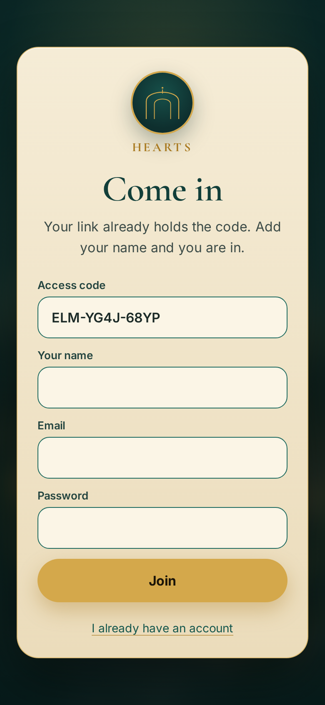
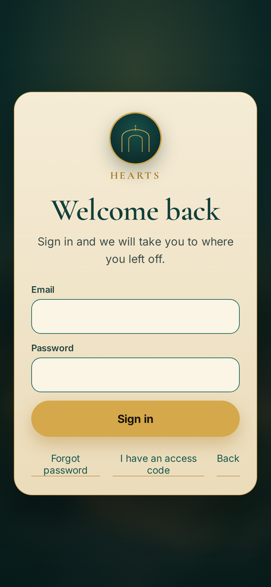
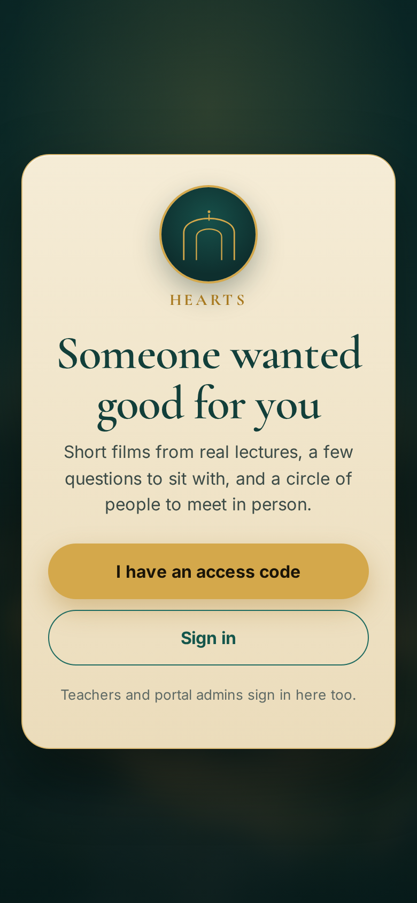
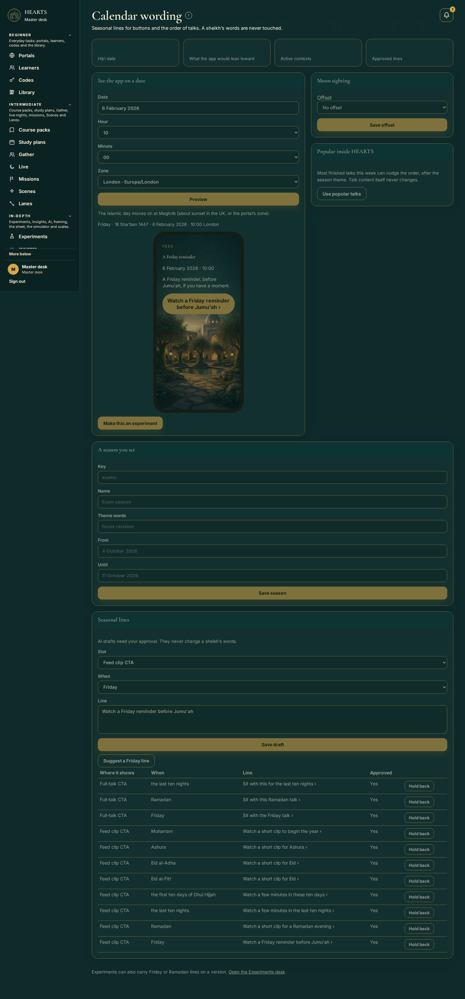
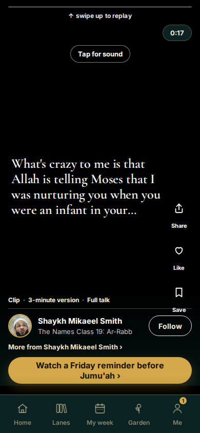
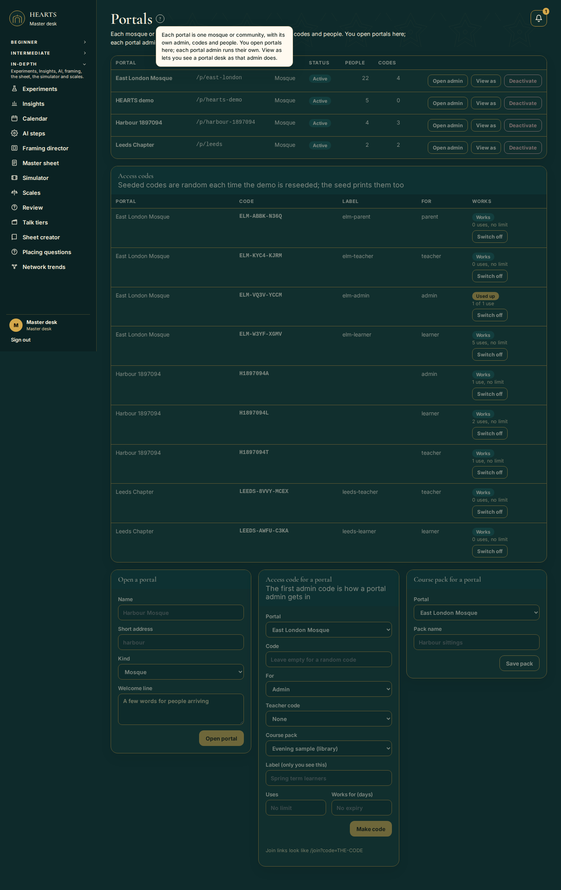
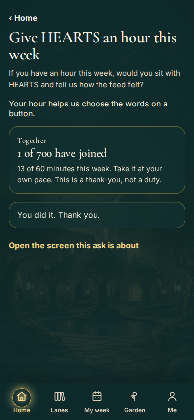
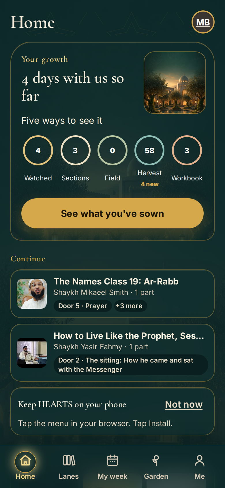

# VERIFY — PR #27 round 6 (`cursor/insights-missions-calendar-eef4`)

**Verdict: FAIL**

Independent verifier. No code was changed on `cursor/insights-missions-calendar-eef4` or any PR branch. This report lives only on `artifacts/verify-pr27-r6`.

Checked on **real Postgres** (empty databases, migrations applied from scratch). Playwright `workers=1`. Production uses Postgres; the builder’s 232/SQLite claim was not re-run here.

| Item | Result |
| --- | --- |
| Remote tip is `085687d` and contains round 6 | PASS |
| Unit tests on the branch | PASS (435 tests, 434 pass, 0 fail, 1 cancelled flake) |
| Typecheck | FAIL vs fair base (40 vs 32 errors; 8 new) |
| Playwright on Postgres vs fair base | FAIL — 1 real regression |
| Migrations from empty + no drift + #23 names | PASS |
| Claim spot-checks | Mixed (see §4) |
| Bottom bar + caption rule | PASS |
| Sibling merge trials | All conflict (see §6) |

---

## 1. Remote tip and round 6 work

- `origin/cursor/insights-missions-calendar-eef4` = `085687d1ed15b3cd5ff716e125072a6d86a7b101`
- Local checkout matched that SHA (clean).
- Round 6 commits are on the tip, including:
  - `4ba1448` Fix round-6 verifier items: Friday window, sunset, privacy, migrations
  - `e1b000a` Keep every desk nav group open…
  - `ac0e9a2` Show the labelled Insights journey…
  - `085687d` Close Beginner and Intermediate for the admin-nav still, leave In-depth open
- PR also contains `bcf6172` Merge PR #24 (`efe888b`).

Fair base used for comparison:

- PR #23 `cursor/clip-feed-fixes-b8ea` tip `20e191c` (on `cursor/compass-gather-demo-ed5a` `9d4c0a0`)
- merged with PR #24 `cursor/r5d-desks-813d` `efe888b`
- clean merge at local `c65ea41` (`verify-base-23-24`)

---

## 2. Unit tests, typecheck, Playwright

All Playwright and migrate runs used Postgres URLs (`hearts_e2e`, `hearts_e2e_base`, `hearts_migrate`). The branch’s `tests/env.ts` still hardcodes SQLite `file:./data/hearts-test.db`; the verifier overrode that **only in `/tmp` worktrees**, never on the PR branch.

### Unit

| Tree | Command | Result |
| --- | --- | --- |
| PR #27 `@ 085687d` | `npm run test:unit` | **435 tests, 434 pass, 0 fail, 1 cancelled** |
| Fair base `c65ea41` | `npm run test:unit` | 380 tests, 379 pass, 1 fail — **verifier-induced** (see below) |

The cancelled branch test is `demo:gather writes only hearts-demo…` (`tests/unit/gather-seed.test.ts:13`, `cancelledByParent`) while another file was pulling a schema. Not a product fail. Treat the builder’s **435/0** as confirmed.

The one base unit fail is `LOW: the browser tests run against their own database file` (`tests/unit/round4.test.ts:172`). It asserts `E2E_DATABASE = 'file:./data/hearts-test.db'`. That string was patched in the base worktree so Playwright could talk to Postgres. **Not a #23/#24 product failure.**

### Typecheck (`npx tsc --noEmit`)

| Tree | Errors |
| --- | --- |
| Fair base | 32 |
| PR #27 | **40** |

Inherited on both (do not treat as new): `src/collections.ts:157`, `src/lib/feed-nav.ts:33`, `src/screens/desk/people.tsx` (18), `tests/e2e/feed-r5a-proof.spec.ts` (9), `tests/e2e/r5d-desks-proof.spec.ts:129`, `tests/unit/feed-nav.test.ts:170`.

**Branch-only (must fix):**

```
src/lib/insight-privacy.test.ts(80,58): error TS2339: Property 'name' does not exist on type 'Field'.
src/screens/desk/experiments.tsx(208,47): error TS2345: Argument of type 'string | number' is not assignable to parameter of type 'number'.
src/server/experiments.ts(112,5): error TS2322: ... 'source: string' is not assignable to type '"ai" | "staff" | "mock"'.
src/server/experiments.ts(827,136): error TS2322: ... not assignable to type 'Where'.
tests/unit/experiments.test.ts(147,99): error TS2353: 'approved' does not exist in type '{ key?: ... }'.
tests/unit/experiments.test.ts(148,102): error TS2353: 'approved' does not exist ...
tests/unit/experiments.test.ts(158,78): error TS2353: 'approved' does not exist ...
tests/unit/experiments.test.ts(159,76): error TS2353: 'approved' does not exist ...
```

### Playwright on Postgres, 1 worker

**PR #27 `@ 085687d`** (`/tmp/pr27-e2e`, port 3100, db `hearts_e2e`):

1. Full 232-file run reached `compass.spec.ts:14` after `demo:compass` seeded `hearts-demo`, then the worker hung (`ep_poll`). Killed. Reproduced on an isolated 3-test compass run. **The 232-test suite does not complete on Postgres.**
2. Remaining 206 tests (everything except the hung compass file): **192 passed, 12 failed, 2 did not run** (38.7m). The 2 skipped are the usual dependents (`integration-final` admin walk; `journeys` main screens).
3. The first 23 tests (ai-steps, auth-garden, circle-sheet, circle) had already passed before the hang.
4. New PR specs that matter: `missions.spec.ts` **4/4 passed** (admin mission + thank-you, Toronto Maghrib, Friday gold button, experiment vs Friday).

**Rerun of the 12 failures once:** **9 failed again (real), 3 passed (flaky).**

| Test | First error | Rerun | Class |
| --- | --- | --- | --- |
| `feed-evening.spec.ts:133` | `feed-evening.spec.ts:171` `expect(seen.bare).toEqual([])` — `"385,422: nothing"` | failed same | inherited |
| `feed-evening.spec.ts:217` | `feed-evening.spec.ts:237` `toContainText("Ready for more?")` on `poster-title` | failed `feed-evening.spec.ts:235` `toHaveAttribute('data-poster', /own\|frame/)` — element not found | **REGRESSION** |
| `feed-polish.spec.ts:50` | `feed-polish.spec.ts:25` `needed a talk before the pool ran out` | failed same | inherited |
| `feed-touch.spec.ts:68` | `feed-touch.spec.ts:86` `data-card` still `"talk"` | failed same | inherited |
| `harvest-lines.spec.ts:65` | `harvest-lines.spec.ts:79` `waitForResponse /api/hearts/harvest` 60s | failed same | inherited |
| `integration-final.spec.ts:67` | `integration-final.spec.ts:112` `not.toHaveAttribute('data-cut', "1")` still `"1"` | failed same | inherited |
| `integration-r3.spec.ts:57` | `integration-r3.spec.ts:77` `getByTestId('caption')` not visible | failed same | inherited |
| `journeys.spec.ts:417` | `journeys.spec.ts:444` `not.toHaveAttribute('data-cut', "27")` still `"27"` | failed same | inherited |
| `nesting-progress.spec.ts:22` | first: empty speaker/slug (`toBeTruthy` `""`); rerun: `nesting-progress.spec.ts:53` `not.toHaveAttribute('data-cut', "27")` | failed | inherited |
| `screenshots.spec.ts:25` | test timeout 300000ms | **passed** | flaky |
| `sheet-creator.spec.ts:61` | `sheet-creator.spec.ts:69` `sheet-creator` not visible (Next memory restart) | **passed** | flaky |
| `r5d-desks-proof.spec.ts:97` | `r5d-desks-proof.spec.ts:173` `door-tile` click, 400000ms | **passed** | flaky |

**Fair base `@ c65ea41`** (port 3200, db `hearts_e2e_base`, compass excluded to avoid the hang): **209 passed, 11 failed, 2 did not run** (42.9m) of 222 tests.

Base failures: the same eight inherited feed/swipe/harvest tests, plus `screenshots.spec.ts:25` (300s), `r5d-desks-proof.spec.ts:97` (400s), and `view-as.spec.ts:156` (`view-as.spec.ts:27` `page.goto /login` after `Server is approaching the used memory threshold, restarting...`). That view-as fail is **base-only** (Next OOM), not a branch regression. `feed-evening.spec.ts:217` **passed on base**. `sheet-creator` **passed on base**.

Compass was **not** run on base (same hang risk). So the compass hang is recorded as a Postgres-suite gap, not a proven vs-base regression.

### Tests that fail on the branch but pass on the base

Only one after the rerun filter:

**`tests/e2e/feed-evening.spec.ts:217` — the extended cut opens on our own poster with the talk title, never a titled YouTube thumbnail**

- Base: **passed**
- Branch first: `feed-evening.spec.ts:237` `expect(poster.getByTestId('poster-title')).toContainText('Ready for more?')` — element(s) not found
- Branch rerun: `feed-evening.spec.ts:235` `expect(poster).toHaveAttribute('data-poster', /own|frame/)` — element(s) not found

Everything else that failed twice on the branch also failed on the fair base (inherited Postgres feed/swipe/harvest issues). Flaky three passed on rerun; two of those also failed on the base first pass.

Builder claim “232 Playwright pass on SQLite, only inherited failures remain” is **not true on Postgres**: the suite cannot finish (`compass` hang), and `feed-evening:217` is a new fail vs #23+#24.

---

## 3. Migrations

Empty database `hearts_migrate` / e2e DBs: **all 18 applied**, including #23 names kept:

- `20261004_180000_gather_entry_code`
- `20261004_210000_schedule_minutes`

PR #27 extras between/after them: `180500_experiments`, `210500_insights_missions`, `235900_insight_privacy`.

Drift: `generateDrizzleJson` vs `20261004_235900_insight_privacy.json` matched except the volatile snapshot `id`. Payload `migrate:create` reported **No schema changes detected** (no new file written). **No drift.**

---

## 4. Claim-by-claim

### Auth / join / front-door stay base parchment (PR #25 owns the look) — PASS

Join, login and `/` use `garden-door` + `door-card`. Computed card background:

`linear-gradient(rgb(245, 236, 214), rgb(235, 220, 187))` = `--gd-parchment` / `--gd-parchment-2` (`#f5ecd6` → `#ebdcbb`).







Note: PR #25’s tip still has a join-only teal override. Merging #25 later will fight this on purpose; #27 correctly left the parchment.

### Friday window = Thursday Maghrib → Jumu'ah, NOAA sunset from portal lat/lon/zone — PASS

`calendar-context.ts`: `friday = thursdayEvening || (weekday === 5 && !afterSunset && clock < jumuahHour)` with default `jumuahHour = 13`. Sunset from NOAA in `sunset.ts`; `coordinatesForZone(portal.timeZone)` (portal stores zone, not lat/lon). Unit tests: London/Toronto Friday 12:00 on, 15:00 off; Thursday after Maghrib on; July sunset ±3 min. E2E `missions.spec.ts:344` and Toronto Maghrib `missions.spec.ts:328` passed. Calendar desk still:



### Button detail like `(12 min)` is kept — PARTIAL / claim miss

`withTalkDetail` in `feed-copy.ts` appends `(N min)` / `(N talks)` onto a **talk-level** custom CTA (`journey.tsx` ~1702). The Friday **hors** gold button uses `clipCta.label` and does **not** call `withTalkDetail`. Phone feed on a Friday window:



Visible label: `Watch a Friday reminder before Jumu'ah ›` — no `(12 min)`.

### Next-day return = localStorage date + days-since bucket, no id sent — PASS

`insight-track.ts`: `hearts.lastVisit` is a `YYYY-MM-DD` string; `returnBucket` is `0` / `1` / `2-7` / `8+`. Client POSTs captured after login:

```json
{"events":[{"kind":"route","route":"/p/east-london","sessionId":"s3opibiqudopmuul96b5","props":{"lane":"","returnBucket":"2-7"}}]}
```

No learner id, no device id in the JSON. `sessionId` is a random `s…` value (sessionStorage). Server `sanitizeProps` strips `learner*` / `device*`. (`hearts_device` cookie is still read for the rate-limit key only; it is not stored on the event row.)

### Shared trusted-IP helper + outer per-IP limit — PASS

`trustedProxyHops()` + `clientIp()` in `rate-limit.ts`. Insights POST passes `clientIp(req, trustedProxyHops())`. `allowInsightIngest` checks `insightIpBurstKey` (`ip-only:…`) **before** the IP+UA key.

### Beginner / Intermediate / In-depth desk nav on #24 nav, current section open — PASS (with still note)

`DeskNav` is wrapped in #24’s `SideNav`. Groups are Beginner / Intermediate / In-depth. First paint opens every group; after that the group that contains `active` stays open. The admin-nav proof still (`085687d`) then closes Beginner and Intermediate and leaves In-depth open — that is the screenshot, not the default first paint.



Calendar page (In-depth) with groups layered:


### Specs do not create `/opt/cursor/artifacts` — PASS

`tests/e2e/artifact-dir.ts` uses `HEARTS_ARTIFACTS` || `SCREENSHOT_DIR` || `os.tmpdir()/hearts-artifacts`. PR #27 runs with `HEARTS_ARTIFACTS=/tmp/pr27-artifacts` wrote only there. `/opt/cursor/artifacts/screenshots` ai-*.png at 01:47 came from the **base** suite (older helper / default path), not from PR #27 specs. `screenshots.spec.ts` still uses a relative `artifacts/screenshots` fallback if env is unset — not `/opt/cursor/artifacts`.

### Tab bar settles after “You did it” — PASS

`mission.tsx` renders `You did it. Thank you.` (`data-testid="mission-done"`) and a `TabBar` on the same screen.



---

## 5. Bottom bar and caption rule

Bottom bar labels from the live phone tab bar: **Home · Lanes · My week · Garden · Me** (`tabbar-text.txt` and stills).



Caption rule: `spokenCaption` in `journey.tsx` returns only the timed tidy/spoken line and **returns empty if that line equals the talk or series title**. `feed-r5a.spec.ts:150` (caption is the timed transcript and never the talk title) **passed** on Postgres. `integration-r3.spec.ts:77` still fails (inherited: caption not found on a Short) — that is the Shorts-in-picture case, not a title fallback.

---

## 6. Sibling merge trials (from `085687d`)

All three conflict. Counts are `<<<<<<<` hunks after `git merge --no-ff`.

### `cursor/r5c-look-words-privacy-923b` `@ 432555c` — MEDIUM (8 files, 15 hunks)

| Hunks | File |
| ---: | --- |
| 1 | `hearts-prototype/src/app/(frontend)/join/page.tsx` |
| 1 | `hearts-prototype/src/components/app/course-player.tsx` |
| 1 | `hearts-prototype/src/components/app/me-controls.tsx` |
| 2 | `hearts-prototype/src/components/app/saved-list.tsx` (add/add) |
| 3 | `hearts-prototype/src/components/app/shell.tsx` |
| 2 | `hearts-prototype/src/screens/app/journey.tsx` |
| 4 | `hearts-prototype/src/screens/app/me.tsx` |
| 1 | `hearts-prototype/src/server/handle.ts` |

Join is the parchment-vs-#25-look fight. `me.tsx` (4) and `shell.tsx` (3) are the painful ones.

### `cursor/courses-planning-3b48` `@ 3ca8534` — HARD (10 files, 31 hunks)

| Hunks | File |
| ---: | --- |
| 1 | `hearts-prototype/src/app/(frontend)/journey.css` |
| 1 | `hearts-prototype/src/app/(frontend)/p/[slug]/[[...screen]]/page.tsx` |
| 2 | `hearts-prototype/src/components/app/feed.tsx` |
| 1 | `hearts-prototype/src/components/app/shell.tsx` |
| **15** | `hearts-prototype/src/components/journey/journey.tsx` |
| 2 | `hearts-prototype/src/screens/app/me.tsx` |
| 2 | `hearts-prototype/src/screens/desk/people.tsx` |
| 1 | `hearts-prototype/src/server/handle.ts` |
| 5 | `hearts-prototype/tests/e2e/fake-youtube.ts` |
| 1 | `hearts-prototype/tests/e2e/feed-evening.spec.ts` |

`journey.tsx` 15 hunks is a real merge, not a tidy conflict.

### `cursor/portal-features-0777` `@ 1ae7f2b` — MEDIUM–HARD (9 files, 16 hunks)

| Hunks | File |
| ---: | --- |
| 1 | `hearts-prototype/src/app/(frontend)/p/[slug]/[[...screen]]/page.tsx` |
| 1 | `hearts-prototype/src/components/app/shell.tsx` |
| 2 | `hearts-prototype/src/components/journey/journey.tsx` |
| 1 | `hearts-prototype/src/lib/desk-help.test.ts` |
| 2 | `hearts-prototype/src/migrations/index.ts` |
| 2 | `hearts-prototype/src/screens/app/home.tsx` |
| 1 | `hearts-prototype/src/screens/app/journey.tsx` |
| 3 | `hearts-prototype/src/screens/app/me.tsx` |
| 3 | `hearts-prototype/src/screens/desk/shell.tsx` |

`migrations/index.ts` plus `desk/shell.tsx` (nav groups) need a careful hand merge so #23 names and the Beginner/Intermediate/In-depth wrap both survive.

---

## 7. What the builder must fix

Do these before claiming round 6 done on Postgres:

1. **Fix the real Playwright regression** `tests/e2e/feed-evening.spec.ts:217` so the extended-cut poster is present with `data-poster` matching `/own|frame/` and the title `Ready for more?` when a poster exists. This **passed on #23+#24** and **failed twice** on `085687d`. Error lines: first `feed-evening.spec.ts:237`, rerun `feed-evening.spec.ts:235`.
2. **Clear the new `tsc` errors** (leave inherited people.tsx / feed-r5a-proof / feed-nav unless you are already there):
   - `src/lib/insight-privacy.test.ts:80` — `Field.name`
   - `src/screens/desk/experiments.tsx:208` — `string | number` vs `number`
   - `src/server/experiments.ts:112` — `source` must be `"ai" | "staff" | "mock"`
   - `src/server/experiments.ts:827` — `Where` union
   - `tests/unit/experiments.test.ts:147-159` — `approved` not on the variant type
3. **Keep `(N min)` on the Friday hors gold button** if that is still a claimed line. Today `withTalkDetail` only wraps the talk-level CTA; the Friday hors pill is `Watch a Friday reminder before Jumu'ah ›` with no minutes (see `phone-feed-plain.png`).
4. **Unstick `compass.spec.ts` on Postgres.** After `demo:compass` the Playwright worker hangs (`ep_oll` / no 180s timeout). The advertised 232-test run cannot finish on the production adapter. Reproduce with a 3-test compass-only run against an empty Postgres database. Do not treat a SQLite pass as enough.
5. **Do not claim a green Postgres Playwright run** while the eight inherited feed/swipe/harvest fails remain. They fail on #23+#24 too (`feed-evening:133`, `feed-polish:50`, `feed-touch:86`, `harvest-lines:79`, `integration-final:112`, `integration-r3:77`, `journeys:444`, `nesting-progress:53`). Either fix them or keep calling them inherited — they are not new, except item 1.

Not required for this FAIL, but note for the next merge: r5c / courses / portal all conflict; courses/`journey.tsx` is the hard one.

---

## Evidence index

| File | What it shows |
| --- | --- |
| `screenshots/phone_join_parchment.png` | Join card, parchment |
| `screenshots/phone_login_parchment.png` | Login card, parchment |
| `screenshots/phone_front_door_parchment.png` | Front door card, parchment |
| `screenshots/phone_home_tabbar.png` | Home · Lanes · My week · Garden · Me |
| `screenshots/phone-feed-plain.png` | Friday hors CTA without `(N min)` |
| `screenshots/phone_feed_after_login.png` | Feed after login (insight POSTs captured) |
| `screenshots/phone-mission-done.png` | “You did it” + tab bar |
| `screenshots/phone-thankyou.png` | Thank-you on Me |
| `screenshots/admin-nav.png` | Desk groups (proof still) |
| `screenshots/calendar-friday.png` | Friday window on the calendar desk |
| `screenshots/insight-payloads.json` | Live `/api/insights` bodies (`returnBucket`, no id) |
| `screenshots/tabbar-text.txt` | `Home / Lanes / My week / Garden / Me` |
| `screenshots/join-card-bg.txt` | Computed parchment gradient |

Verifier SHAs: branch `085687d`, fair base `c65ea41` = `20e191c` + `efe888b`. Date: 5 October 2026.
